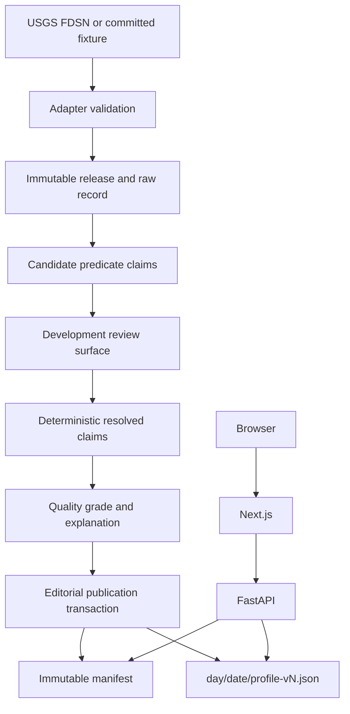

# Senior Engineering Handoff

## 1. Executive State

- Current branch: `agent/usgs-earthquake-vertical-slice`.
- Latest committed baseline: `46dffaa` (`Merge pull request #1 ... usgs-readiness`). The slice is intentionally documented before its final commit; use `git log -1` after checkout for the published slice commit.
- Working-tree status at handoff drafting: expected Phase 2 modifications and additions only; no unrelated changes observed.
- Current phase: one complete official-USGS evidence-to-publication vertical slice.
- Genuinely working: empty PostGIS migration through `0007`; committed-fixture ingestion; checksum/idempotency/raw immutability; nine predicate claims; review tasks; deterministic resolution; event/time/geography projection; public quality grade; immutable versioned profile; hash-verifying API; golden frontend; provenance control; tests/build.
- Only scaffolded: live USGS retrieval has a real implementation and command but was not executed in final verification; development review is an API surface, not a polished admin UI; broader profile sections are explicit unavailable states.
- Broken: no known failure in the verified golden path.

## 2. Product Contract

- Purpose: evidence-resolution and historical comparison organized around dates, not trivia.
- Supported date shell: `1900-01-01` through `2025-12-31`.
- Current profile coverage: one standard-statistical profile, `1964-03-27`.
- Epistemic rules: recorded event, context, derivation, and absence remain separate; missing is never zero; single-source acceptance is visible; every populated statement has public provenance.
- Non-negotiable architecture: immutable releases/raw records/manifests; claims are atomic; corrections/version changes append; no third-party render-time requests; API reads verified published JSON instead of rebuilding from large joins.

## 3. Repository Map

- `apps/web/`: Next.js App Router public shell. Entry points are `app/page.tsx` and `app/day/[date]/page.tsx`; `DayProfileClient.tsx` owns API states; `ProfileSections.tsx` owns section separation and provenance rendering.
- `services/api/`: FastAPI, SQLAlchemy, Alembic, pipeline, and publication ownership. `app/main.py` is HTTP; `app/usgs.py` is adapter/orchestration; `app/usgs_cli.py` is offline CLI; `app/services.py` is foundational claim/publication logic.
- `packages/contracts/`: shared TypeScript public response/profile shapes. It does not own database models.
- `data/fixtures/`: committed test-only/raw source fixtures. USGS fixture is an official minimal query response and is never a fake production fact.
- `docs/`: product, architecture, lifecycle, schema, decisions, live status, and this takeover record.
- `infra/` and `docker-compose.yml`: local PostGIS ownership.
- `scripts/`: foundation fixture utilities; USGS commands are exposed through the Makefile and Python module.
- `.local/`: ignored development raw/profile objects; never public source code.

## 4. Runtime Architecture

Browser request path: browser -> Next `/day/{date}` -> internal Next `/api/day/{date}` proxy -> FastAPI `/api/v1/day/{date}` -> latest published manifest -> local publication store read/hash verification -> stored JSON -> validated frontend contract.

Pipeline path: explicit CLI -> official live response or committed fixture -> Pydantic validation -> raw checksum/store -> immutable release/raw record -> predicate claims/review tasks -> quality check.

Review path: development-only guarded endpoints list claims/conflicts/tasks, change candidate status, resolve a release, publish, and inspect a manifest.

Publication path: accepted claims -> versioned resolved claims -> event/time/geography projections -> quality assessment -> editorial section selection -> evidence snapshots -> versioned JSON -> published manifest/day profile.



## 5. Database State

Migrations in order:

1. `20260723_0001_foundation.py`
2. `20260723_0002_publication_provenance.py`
3. `20260723_0003_integrity_hardening.py`
4. `20260723_0004_lifecycle_integrity.py`
5. `20260723_0005_publication_evidence_snapshots.py`
6. `20260724_0006_methodology_quality_targets.py`
7. `20260724_0007_usgs_vertical_slice.py`

Implemented foundation tables: `sources`, `source_releases`, `source_lineage`, `claims`, `resolved_claims`, `resolved_claim_evidence`, `events`, `event_times`, `geographies`, `geography_versions`, `event_locations`, `people`, `organizations`, `entity_aliases`, `external_identifiers`, `metrics`, `observations`, `event_impacts`, `metric_coverage`, `quality_assessments`, `methodologies`, `derived_values`, `derived_value_inputs`, `publication_manifests`, `publication_statement_evidence`, `day_profiles`, `pipeline_runs`, `quality_checks`, `review_tasks`, `corrections`.

Phase 2 adds `raw_source_records`; no required table is deferred. Important constraints include immutable releases/raw records/final manifests/evidence, release checksum idempotency, claim record hashes, bounds order, complete local-time interpretation, quality grade/explanation pairing, support evidence cardinality, version uniqueness, and predecessor integrity.

Known schema compromises: quality dimensions remain validated application JSON rather than database columns; review task status/priority remain constrained strings; generic source-record payload is JSONB plus raw filesystem bytes.

Seed behavior: `make seed` remains unmistakably test-only. `make ingest-usgs-fixture` creates the real golden release from the committed official fixture.

## 6. Claim Lifecycle State

Golden chain:

```text
USGS record official19640328033616_30
-> release usgs-official19640328033616_30-32beb46bd6d5
-> 9 imported candidate claims
-> accepted single-source resolved claims (version 1)
-> Grade B quality assessment with 8 dimensions
-> 5 recorded statements + 1 evidence statement
-> publication manifest version 1
-> day/1964-03-27/profile-v1.json
```

Internal identifiers are generated UUIDs and intentionally excluded from the public UI. Useful stable identifiers are source slug `usgs-earthquake-catalog`, record ID `official19640328033616_30`, canonical claim keys `usgs:official19640328033616_30:{predicate}`, methodology `usgs-authoritative-single-source@1`, and fixture SHA-256 `32beb46bd6d5fd5b06943c08e32f4a83ad4a90a28690bea49c42f3da59210c8b`.

## 7. Source Adapter State

- Interface: `SourceAdapter` and `RawSourceStore` protocols in `services/api/app/usgs.py`.
- USGS implementation: `USGSEarthquakeAdapter` validates FDSN FeatureCollection GeoJSON and exactly one golden record.
- Fixture: `data/fixtures/usgs/1964-prince-william-sound.geojson`.
- Retrieval: fixture bytes or explicit official query using a named user agent and timeout; never used during page rendering.
- Idempotency: unique source/checksum release; identical rerun records a successful idempotent pipeline run and reuses claims/raw record.
- Raw storage: checksum-addressed local file plus immutable `raw_source_records` row and validated payload JSON.
- Checksums: SHA-256 over exact retrieved bytes and repeated on release, raw record, and each source claim.
- Failure: validation failure records failed run/check inside the caller transaction and creates no release, claims, manifest, or profile. Publication also rejects a failed release check.
- Unsupported fields: casualties and other human impacts. They are public unavailable states, never zero.
- Official references: `https://earthquake.usgs.gov/fdsnws/event/1/` and `https://earthquake.usgs.gov/earthquakes/eventpage/official19640328033616_30`.

## 8. Commands

```bash
# Clean install
corepack pnpm install --frozen-lockfile
python -m venv .venv
.venv/bin/python -m pip install --upgrade pip
.venv/bin/python -m pip install -e 'services/api[dev]'

# Environment configuration (defaults work locally; optional overrides)
cp services/api/.env.example services/api/.env
cp apps/web/.env.example apps/web/.env.local

# Database
make db-up
make db-reset
make db-migrate
make seed

# Ingestion
make ingest-usgs-fixture
make ingest-usgs-dry-run
make ingest-usgs-live

# Publication
make publish-golden

# Services
make api
make web

# Unit and integration tests
make contracts-test
make web-test
make api-test
make test-integration

# Browser tests
make test-e2e

# Quality
make api-lint
make api-typecheck
make contracts-lint
make contracts-typecheck
make web-lint
make web-typecheck
make web-build

# Full verification
make verify
```

## 9. Verification Evidence

All timestamps below are 2026-07-24 CDT.

- `make check`, 13:03: passed. Ruff clean; strict mypy 19 files; pytest 55 passed; contracts checks and 1 Vitest passed; web checks and 4 Vitest passed. Earlier attempts found and resolved stopped DB, immutable-release construction, canonical review status, and nullability defects.
- `make db-reset && make db-up && make db-migrate`, 13:04: passed from empty volume through migration `0007`.
- `make ingest-usgs-fixture`, 13:04: passed, non-idempotent first import, checksum `32beb46b...10c8b`.
- `make publish-golden`, 13:04: passed; profile v1 created.
- Temporary Uvicorn plus `curl /api/v1/day/1964-03-27`, 13:04: passed; content hash `c9ce3b50ff2481307cc8b47e44e45b1ce2b38d9780ff478c5611318203dc6063`, grade B, five recorded statements, seven sections, casualty unavailable, provenance keys complete.
- `make web-build`, 13:04: passed with Next.js 15.5.21.
- `make web-e2e`, 13:04: 2 passed. Warning: `NO_COLOR` ignored because `FORCE_COLOR` is set; no functional impact.
- Live ingestion was not run, to avoid changing the reproducible release during final verification.

## 10. Files Changed

- `Makefile`: exact migration/ingest/publish/start/test/build/verify commands.
- `README.md`: clean USGS workflow, runtime path, development review warning.
- `data/fixtures/usgs/1964-prince-william-sound.geojson`: official network-independent source fixture.
- `services/api/alembic/versions/20260724_0007_usgs_vertical_slice.py`: evidence schema/constraints.
- `services/api/app/config.py`: raw storage root and development review token.
- `services/api/app/models.py`: raw record and new evidence/time/quality/manifest fields.
- `services/api/app/services.py`: atomic release creation, richer claim/resolution inputs, snapshots, versioned profile paths.
- `services/api/app/usgs.py`: adapter, raw store, ingestion, resolution, quality, projections, publication.
- `services/api/app/usgs_cli.py`: explicit offline command entry point.
- `services/api/app/main.py`: verified golden API and minimal guarded review endpoints.
- `services/api/tests/test_usgs_vertical_slice.py`: slice behavioral/integrity tests.
- `packages/contracts/src/index.ts`: structured public profile, provenance, section-state contract.
- `apps/web/src/lib/day-profile.ts`: runtime response validation.
- `apps/web/src/components/DayProfileClient.tsx`: populated profile state plumbing.
- `apps/web/src/components/ProfileSections.tsx`: unavailable states, quality, source, provenance disclosure.
- `apps/web/src/components/DayProfileClient.test.tsx`: golden rendering/provenance tests.
- `apps/web/e2e/golden-profile.spec.ts`: browser golden/provenance acceptance.
- `apps/web/app/globals.css`: provenance disclosure styling.
- `docs/ARCHITECTURE.md`: Phase 2 runtime map.
- `docs/CLAIM_LIFECYCLE.md`: applied lifecycle and correction behavior.
- `docs/DATA_DICTIONARY.md`: every Phase 2 schema field/constraint/deletion rule.
- `docs/DECISIONS.md`: D012-D015.
- `docs/STATUS.md`: reconciliation, contract, progress, verification.
- `docs/HANDOFF.md`: senior takeover package.

Every change traces to the vertical-slice contract; no unrelated product feature was added.

## 11. Decisions

- D012: official FDSN summary response is the first immutable adapter release.
- D013: UTC occurrence and historical local civil date are separate facts/assignments.
- D014: public artifacts are version-addressed and content-hash verified.
- D015: review uses an explicitly insecure development guard until production authentication is designed.

Full entries are in `docs/DECISIONS.md`. Foundation decisions D001-D011 remain in force.

## 12. Known Defects

### Generic lineage roots are caller-normalized

- Observable behavior: `deterministic_resolution` correctly counts repeated `lineage_root` once, but it does not traverse `source_lineage` itself.
- Likely cause: the first adapter has one direct official release, so only the narrow extension point was implemented.
- Relevant file: `services/api/app/usgs.py`.
- Reproduction: call the resolver with incorrectly normalized roots; the function trusts them.
- Severity: medium for the next multi-source slice; low for the single USGS release.
- Takeover block: no, but must be fixed before independent corroboration is claimed across imported sources.

### Browser acceptance stubs the API envelope

- Observable behavior: Playwright proves rendering and disclosure interaction using route interception; live API artifact integrity is tested separately in pytest and curl.
- Likely cause: the existing Playwright harness starts only Next.js.
- Relevant files: `apps/web/e2e/golden-profile.spec.ts`, `services/api/tests/test_usgs_vertical_slice.py`.
- Reproduction: `make web-e2e` and inspect the intercepted route.
- Severity: medium test gap.
- Takeover block: no; add one composed full-stack browser test before deployment work.

### Development review is not production security

- Observable behavior: possession of one configured header token permits review actions.
- Likely cause: production authentication is explicitly deferred.
- Relevant files: `services/api/app/main.py`, `services/api/app/config.py`.
- Reproduction: call an admin endpoint with the configured token.
- Severity: critical if deployed publicly; expected locally.
- Takeover block: blocks production deployment, not local takeover.

### Unchanged explicit republish can create a new version

- Observable behavior: invoking publication again creates profile v2 even if content is unchanged.
- Likely cause: explicit publish is treated as an editorial revision, while ingestion alone is idempotent.
- Relevant files: `services/api/app/usgs.py`, `services/api/app/services.py`.
- Reproduction: run `make publish-golden` twice.
- Severity: low; history remains immutable and correct.
- Takeover block: no; operational tooling should preview/no-op identical content if desired.

## 13. Deferred Scope

UN demographic pipeline; UCDP pipeline; Wikidata candidate ingestion; curated apocalypse dataset; wonder dataset; metric scoring; golden set of 100 dates; casualty source; broader historical context/statistics; production authentication; deployment; licensing review; GDELT; EM-DAT; full ranking; accounts/social/user claims; ancient history; AI historical facts; all date profiles.

## 14. Senior Takeover Order

1. Goal: close multi-source independence semantics. Required files: `app/usgs.py`, `models.py`, `services.py`, source-lineage tests. Prerequisite: one second authoritative adapter proposal. Acceptance: lineage roots are computed from immutable release graph and dependent copies never increase independence. Risks: cycles and mixed derivation. Tests: cycles, transitive copies, independent agreement, bounded/unresolved disagreement.
2. Goal: add composed full-stack browser verification. Required files: Playwright config/specs, Makefile, test environment. Prerequisite: deterministic fixture database bootstrap. Acceptance: browser -> Next -> live FastAPI -> stored profile succeeds and corruption fails visibly. Risks: process cleanup/ports. Tests: golden, unpublished, corrupt artifact.
3. Goal: harden review workflow before another data source. Required files: `main.py`, review models/services, a minimal utilitarian admin route. Prerequisite: product decision on reviewer roles. Acceptance: candidate decisions, conflict view, resolution preview, publish confirmation, manifest view are integration-tested and audited. Risks: authorization and concurrent edits.
4. Goal: select a separate authoritative impact source or explicitly defer impacts longer. Required files: product/decision docs and new adapter only after legal review. Prerequisite: source/licensing decision. Acceptance: no casualty claim without direct lineage and uncertainty; disagreement visible. Risks: casualty estimate definitions and revisions.
5. Goal: expand to the next vertical date/source without widening runtime joins. Required files: adapter extension and publication composition. Prerequisite: tasks 1-3. Acceptance: existing golden profile remains byte/hash/version stable and new profile uses the same chain. Risks: speculative abstraction.

## 15. Unresolved Questions

- Which authoritative source and definition, if any, may support earthquake fatalities?
- Should identical explicit republishes no-op, or should every editorial action create a version?
- What reviewer roles, approval cardinality, and audit identity are required before deployment?
- Should public provenance expose release retrieval timestamps indefinitely if they reveal operational cadence?
- What licensing/attribution review is required for long-term redistribution of stored USGS payloads?
- Which second source is suitable to prove database-derived source independence without expanding scope sideways?

## 16. Diff Reconstruction

The slice adds one official fixture, one migration, one adapter/orchestrator/CLI, review endpoints, public contract/rendering, tests, commands, and reconciled documentation. It was required by the adapter, claim, resolution, quality, publication, API, frontend, admin, test, and handoff clauses. Foundation services were changed only where the new slice required atomic release construction, record hashes/bounds/units, versioned resolution, evidence snapshots, and stable immutable object paths. No change lacks a contract justification. Required but absent: production auth/deployment and unrelated datasets are deliberately out of scope; a composed real full-stack browser test remains a disclosed test gap.

## 17. Final Honesty Check

- Can a new engineer start from README? Yes; the clean path was run successfully.
- Can the golden source record be reproduced? Yes from exact committed bytes; live upstream bytes may later differ and become a new release.
- Can every published statement be traced? Yes, through public provenance and immutable internal evidence snapshots.
- Can failed ingestion accidentally publish? Not through the verified orchestrator; failed validation creates no release/profile and failed checks block publication.
- Can version 1 be silently rewritten? No; storage refuses hash mismatch and database triggers protect final manifests/evidence/day profiles.
- Are tests network-independent? Yes.
- Does UI distinguish fact, context, derivation, and absence? Yes; sections remain separate and unsupported states are explicit.
- What would I distrust as an inheritor? I would not claim multi-source independence until lineage roots come from the database graph, and I would not treat the development review token as security. I would also add the composed browser/API/database test before production deployment.

Final verification addendum: at 13:08 CDT, frozen pnpm install and Python editable install passed, followed by a complete successful `make verify`. pnpm warned that dependency build scripts for `esbuild`, `sharp`, and `unrs-resolver` were ignored; the subsequent Next.js production build completed successfully. This addendum is part of Section 9 verification evidence.
