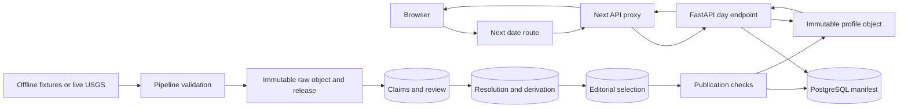

# Senior Engineering Handoff

## 1. Executive State

- Current branch: `agent/senior-takeover-mvp`
- Latest implementation commit: `c95b8db` (`audit and harden evidence
  publication slice`). The metadata-only commit containing this finalized
  handoff follows it; use `git log -1 --oneline` for that self-referential SHA.
- Working tree: expected clean after the handoff metadata commit. Publication to
  GitHub is blocked locally because the HTTPS credential is invalid and no SSH
  key is accepted.
- Current phase: senior foundation repair plus a multi-source standard-profile
  proof
- Genuinely working: migrations through `0009`; offline USGS, UN WPP, UCDP and
  Wikidata fixture ingestion; review ledger; deterministic USGS/UCDP/UN
  resolution and derivation; license publication gate; immutable profile
  versions; hash-verifying API; public profile; development review console;
  mocked and real full-stack browser tests
- Scaffolded only: Golden 100 selection, production deployment notes, model-card
  directory, review authentication and live ingestion outside USGS
- Broken or absent: the remaining MVP datasets, comparison system, reviewed
  Golden 100, three-era publication coverage, production auth, production
  object storage, deployment and accessibility audit

The contracted MVP is not complete and release is blocked.

## 2. Product Contract

- Purpose: resolve evidence and historical comparisons around dates, not
  generate “on this day” trivia
- Supported shell: `1900-01-01` through `2025-12-31`
- Current published coverage: `1964-03-27` only
- Epistemic rule: recorded facts, annual context, derived values, curated
  claims, comparisons, missingness and disagreement must remain visible as
  different evidence classes
- Non-negotiable rule: every factual statement traces to a resolved claim or
  derived value, imported claim or observation, immutable release/raw record,
  methodology/code version and publication manifest
- Prohibited behavior: absent data as zero, republishers as independent,
  annual equivalents as day observations, silent manifest rewrites, runtime
  third-party queries, publication after failed checks, universal badness
  scores, GDELT, or unlicensed EM-DAT

## 3. Repository Map

- `apps/web/`: Next.js 16 public app, API proxies and development review console
- `services/api/app/`: FastAPI routes, models, governance, adapters, pipelines,
  publication and CLI entry points
- `services/api/alembic/`: migrations and database lifecycle constraints
- `services/api/tests/`: PostgreSQL/PostGIS integration and API tests
- `packages/contracts/`: shared TypeScript public profile types
- `data/fixtures/`: committed network-independent official-source excerpts
- `data/golden-set/`: Golden 100 selection candidates and review status
- `docs/SOURCE_LICENSES/`: source-level terms snapshots and inventory
- `docs/MODEL_CARDS/`: comparison-model gate; no approved model exists
- `scripts/`: local reset and real full-stack browser orchestration
- `.github/workflows/ci.yml`: clean migration, ingestion, publication and
  verification workflow
- `.local/`: ignored local raw objects, published profiles, logs and backups

## 4. Runtime Architecture



Browser requests never contact USGS, UN, UCDP or Wikidata. FastAPI finds the
latest published manifest and reads the stored JSON object with hash
verification. PostgreSQL remains authoritative for evidence, review,
methodology, corrections and manifests. The admin path is browser ->
`/api/admin/*` -> FastAPI `/api/v1/admin/*` under a development-only token.

## 5. Database State

Migrations in order:

1. `20260723_0001_foundation.py`
2. `20260723_0002_publication_provenance.py`
3. `20260723_0003_integrity_hardening.py`
4. `20260723_0004_lifecycle_integrity.py`
5. `20260723_0005_publication_evidence_snapshots.py`
6. `20260724_0006_methodology_quality_targets.py`
7. `20260724_0007_usgs_vertical_slice.py`
8. `20260724_0008_publication_governance.py`
9. `20260724_0009_period_context.py`

All foundation tables are implemented. `0008` adds immutable
`source_release_licenses`, `claim_review_decisions` and
`editorial_selections`. `0009` adds `period_context` so annual aggregates are
not mislabeled. Source releases, raw records, published manifests, statement
snapshots and day profiles are immutable. Missing values remain distinct from
zero. Historical geography uses non-overlapping versions.

Known schema compromise: publisher-managed object storage and the database do
not share one atomic transaction. A failed database commit can leave an
unreferenced immutable object, though it cannot make that object publicly
discoverable without a committed manifest. Garbage collection and durable
object-store finalization remain production work.

## 6. Claim Lifecycle State

The golden chain is:

```text
USGS event us7000dflf raw record
-> nine imported atomic claims
-> explicit accepted review decisions
-> nine resolved claims
-> canonical earthquake/time/geography
-> derived public quality grade
-> editorial selections
-> publication manifest
-> day/1964-03-27/profile-vN.json
```

UN WPP adds 20 annual claims, 20 resolutions, structured metrics and
observations, and two uniform-period daily equivalents. UCDP adds 25 1964
conflict-year claims whose 25 resolved inputs produce one period-context count.
Wikidata Q749610 revision 2497659168 creates eight candidates and eight review
tasks; it creates no resolution or canonical event.

Stable record identifiers:

- USGS `us7000dflf`
- UN WPP `900:1964:estimates`
- UCDP/PRIO `conflict:{conflict_id}:1964`
- UCDP GED `ged:6833`
- Wikidata `Q749610` revision `2497659168`

## 7. Source Adapter State

- Shared contract: `app/adapters/base.py`
- USGS: fixture and live retrieval, dry run, immutable raw storage,
  record-specific hash, idempotency, run/check records, transformation,
  explicit review and publication
- UN WPP: strict selected official excerpt, immutable raw storage, 20 claims,
  metrics/observations/coverage, daily-equivalent derivation and publication;
  live workbook retrieval is absent
- UCDP: strict official 26.1 annual and GED excerpts, idempotency, run/check
  records, 1964 period context and one bounded event impact; live retrieval and
  full revision processing are absent
- Wikidata: pinned official entity JSON, dry run, idempotency, eight candidate
  claims and review tasks; no automatic acceptance
- Failure behavior: schema validation failures record a failed run/check and do
  not create a release or publication

## 8. Commands

Clean install:

```bash
make install
```

Environment:

```bash
cp .env.example .env
cp apps/web/.env.example apps/web/.env.local
```

Database and migration:

```bash
make db-up
make db-migrate
```

Fixture ingestion and review:

```bash
make ingest-usgs-fixture
make review-usgs-fixture
make ingest-un-wpp-fixture
make review-un-wpp-fixture
make ingest-ucdp-annual-fixture
make review-ucdp-annual-fixture
make ingest-ucdp-ged-fixture
make review-ucdp-ged-fixture
make ingest-wikidata-fixture
```

Live USGS and dry runs:

```bash
make ingest-usgs-live
make ingest-usgs-dry-run
make ingest-wikidata-dry-run
```

Publication and services:

```bash
make publish-golden
make api
make web
```

Verification:

```bash
make check
make web-build
make web-e2e
make web-e2e-full-stack
make validate-golden-set
corepack pnpm audit --prod
.venv/bin/python -m pip_audit
```

Full clean local proof:

```bash
make clean-reset
make db-up
make db-migrate
make ingest-usgs-fixture
make review-usgs-fixture
make ingest-un-wpp-fixture
make review-un-wpp-fixture
make ingest-ucdp-annual-fixture
make review-ucdp-annual-fixture
make ingest-ucdp-ged-fixture
make review-ucdp-ged-fixture
make ingest-wikidata-fixture
make publish-golden
make check
make web-build
make web-e2e
make web-e2e-full-stack
```

## 9. Verification Evidence

- 2026-07-24 13:50 CDT: clean reset, PostGIS startup, migrations `0001` through
  `0009`, USGS/UN/UCDP ingestion and review, and v1 publication passed
- 2026-07-24 14:04 CDT: 71 Python tests, 1 contracts test and 5 web tests
  passed; production build passed
- 2026-07-24 14:06 CDT: initial real E2E failed because the UCDP provenance
  producer violated the nested frontend contract; producer and runtime
  validation were repaired
- 2026-07-24 14:07 CDT: real E2E failed because annual-equivalent
  non-observation language was not visible; published wording was repaired
- 2026-07-24 14:07 CDT: real full-stack E2E passed
- 2026-07-24 14:09 CDT: Next 16 lint, TypeScript, 5 web tests, production build
  and `pnpm audit --prod` passed
- 2026-07-24 14:09 CDT: mocked Playwright passed 2 with the real-only spec
  skipped; real full-stack Playwright passed 1
- 2026-07-24 14:10 CDT: `pip-audit` found no known third-party Python
  vulnerabilities; `pip check` passed
- 2026-07-24 14:10 CDT: API Ruff, strict mypy and 71 tests passed
- Warning: Starlette reports that its httpx TestClient bridge is deprecated in
  favor of `httpx2`
- Warning: pnpm reports ignored install scripts for selected native packages;
  builds and browser tests pass

### Final verification, 2026-07-24 14:18 CDT

- `make verify`: passed.
- Python: 71 passed; Ruff and mypy passed. One Starlette TestClient deprecation warning remains.
- TypeScript: contracts lint/type/test passed; web lint/type/test passed (5 tests); Next.js production build passed.
- Browser: mocked suite passed (2 passed, 1 real-stack case intentionally skipped); real API/artifact/browser suite passed (1 passed).
- Golden set: 100 records validate structurally; 0 reviewed and 0 published, so `release_ready=False`.
- Dependency audit: pnpm and pip-audit reported no known third-party vulnerabilities; the local package is not a PyPI audit target.

## 10. Files Changed

Foundation and pipelines:

- `services/api/alembic/versions/20260724_0008_publication_governance.py`
- `services/api/alembic/versions/20260724_0009_period_context.py`
- `services/api/app/adapters/base.py`
- `services/api/app/governance.py`
- `services/api/app/un_wpp.py`
- `services/api/app/ucdp.py`
- `services/api/app/wikidata.py`
- `services/api/app/candidate_cli.py`
- `services/api/app/context_cli.py`
- `services/api/app/golden_set.py`
- `services/api/app/usgs.py`
- `services/api/app/usgs_cli.py`
- `services/api/app/main.py`
- `services/api/app/models.py`

Tests and fixtures:

- `services/api/tests/test_governance.py`
- `services/api/tests/test_un_wpp.py`
- `services/api/tests/test_ucdp.py`
- `services/api/tests/test_wikidata.py`
- `services/api/tests/test_golden_set.py`
- `services/api/tests/test_usgs_vertical_slice.py`
- `data/fixtures/un-wpp/*`
- `data/fixtures/ucdp/*`
- `data/fixtures/wikidata/Q749610.json`
- `data/golden-set/golden-dates-v1.json`

Frontend and contracts:

- `apps/web/app/admin/review/page.tsx`
- `apps/web/app/api/admin/[...path]/route.ts`
- `apps/web/src/components/AdminReviewPage.test.tsx`
- `apps/web/src/components/DayProfileClient.tsx`
- `apps/web/src/components/ProfileSections.tsx`
- `apps/web/src/lib/day-profile.ts`
- `apps/web/e2e/full-stack-golden.spec.ts`
- `apps/web/playwright.config.ts`
- `apps/web/app/globals.css`
- `packages/contracts/src/index.ts`

Operations and dependencies:

- `.github/workflows/ci.yml`
- `Makefile`
- `README.md`
- `package.json`
- `pnpm-lock.yaml`
- `apps/web/package.json`
- `apps/web/eslint.config.mjs`
- `apps/web/tsconfig.json`
- `services/api/pyproject.toml`
- `services/api/requirements.lock`
- `scripts/reset_local_dev.sh`
- `scripts/run_full_stack_e2e.sh`
- `docs/SENIOR_TAKEOVER_AUDIT.md`
- `docs/STATUS.md`
- `docs/HANDOFF.md`
- `docs/RELEASE_CHECKLIST.md`
- `docs/SECURITY_REVIEW.md`
- `docs/BACKUP_RESTORE.md`
- `docs/DEPLOYMENT.md`
- `docs/SOURCE_LICENSES/*`
- `docs/MODEL_CARDS/*`

Every change traces to foundation repair, source ingestion, review,
publication, runtime verification, licensing, security or handoff requirements.

## 11. Decisions

- Publication eligibility is a database-backed gate over license, successful
  run, passed checks, explicit review and editorial selection.
- Annual equivalents are derived values with
  `uniform_period_allocation`; annual conflict counts use `period_context`.
- Wikidata is candidate discovery, not independent confirmation.
- Review decisions are append-only and resolution cannot accept candidates.
- Golden 100 selection and human review are separate statuses.
- Vulnerable framework transitive dependencies are fixed at the maintained
  framework and lockfile boundary.
- Production deployment remains blocked rather than simulated.

Full rationale is in `docs/DECISIONS.md`.

## 12. Known Defects

- Only one date is published. Severity: release blocker.
- Golden 100 records are not reviewed or generated. Severity: release blocker.
- UN and UCDP support only selected fixtures, not full supported-year releases.
  Severity: release blocker.
- Apocalypse, wonder/progress and comparison systems are absent. Severity:
  release blocker.
- Review guard is not production authentication. Severity: critical for public
  deployment.
- Publication file creation and database commit are not one atomic transaction;
  failed commits can leave unreferenced objects. Severity: medium, takeover does
  not block but production launch does.
- Repeated explicit publication creates a new version even when content is
  identical. Severity: low.
- Starlette TestClient emits one deprecation warning. Severity: low.
- No accessibility scanner or manual accessibility review. Severity: release
  blocker.

## 13. Deferred Scope

UN full demographic pipeline; UCDP full pipeline; broader Wikidata/Wikimedia
candidate ingestion; curated apocalypse catalog; wonder dataset; metric
comparison models; reviewed Golden 100; production authentication; production
object storage; deployment; legal approval; GDELT; EM-DAT; universal badness
score; accounts, comments and social features.

## 14. Senior Takeover Order

1. Complete human/product decisions for source licensing and catalog scope.
   Acceptance: approved sources and explicit exclusions.
2. Implement full-version UN and UCDP release import with revision tests.
   Acceptance: supported-year metric coverage and no fixture-only production
   claims.
3. Implement Wikidata entity/duplicate/merge workflows.
   Acceptance: candidate people, organizations, aliases and identifiers remain
   review-gated.
4. Build curated apocalypse and wonder catalogs.
   Acceptance: primary/secondary claim provenance, coverage grade and no
   manufactured balance.
5. Implement one frozen-cohort comparison model and model card.
   Acceptance: denominator, cohort hash, missing policy and sensitivity tests.
6. Generate, validate and manually review the Golden 100.
   Acceptance: all 100 profiles green and one profile per era.
7. Replace development auth, add production object storage and complete
   security/accessibility/backup gates.
8. Deploy only after the release checklist is green.

## 15. Unresolved Questions

- Which human or role may approve source-license eligibility?
- What constitutes sufficient editorial review for each Golden 100 profile?
- Which primary sources may support the apocalypse catalog and translations?
- Which positive-milestone catalog scope is defensible for MVP?
- Which comparison cohort and minimum coverage are product-approved?
- Should identical explicit republishes no-op?
- Which production identity, hosting, storage and observability providers are
  approved?

## 16. Diff Reconstruction

The takeover repaired governance/licensing/review defects, added UN/UCDP
structured context, added safe Wikidata candidates, made annual semantics
visible, added a real runtime test, created a development review console,
selected but did not falsely review Golden 100 dates, and closed dependency
vulnerabilities. No unrelated product feature was added. Required but absent
MVP work is listed in Sections 12 through 15 and the release checklist.

## 17. Final Honesty Check

- Can a new engineer start from README? The documented clean path has passed.
- Can source records be reproduced? Committed fixtures and upstream identities
  are pinned; only USGS has live retrieval.
- Can every current published statement be traced? Yes for the one golden
  profile.
- Can failed ingestion publish? No through the tested adapters and eligibility
  gate.
- Can version 1 be silently rewritten? No.
- Are tests network-independent? Yes.
- Does the UI distinguish recorded facts, annual context, derivation and
  absence? Yes for the current profile.
- Is the MVP complete? No.
- What should an inheritor distrust? Fixture breadth, the development auth
  boundary, absent human review, non-atomic DB/object finalization and every
  red release gate.
